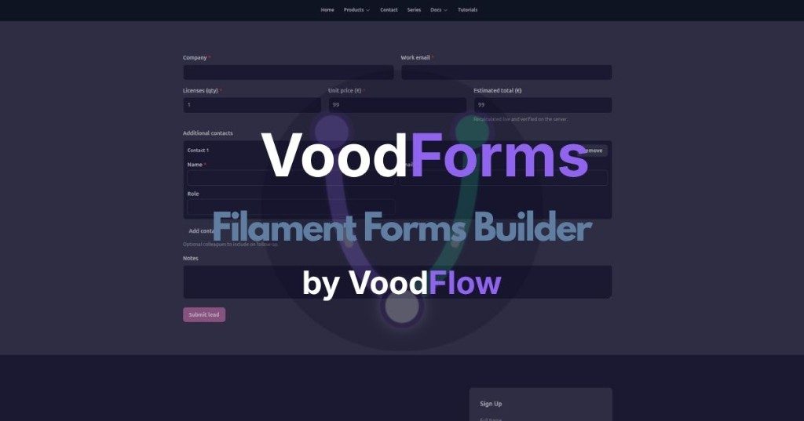

# VoodForms (`voodflow/vforms`)

> Public README mirror for Filament / marketing links. Canonical product docs: [docs.voodflow.com](https://docs.voodflow.com). Package source remains private/licensed.



FilamentPHP 5 plugin for **managed forms**: schema builder, API-driven fields, mid-form gates, uploads, notifications, analytics, public runtime, and optional companions.

## Agnostic plugins

Vforms works **without** VoodBuilder and **without** Voodflow.

| Companion | Soft gate | What it enables |
|-----------|-----------|-----------------|
| none | — | Filament CRUD, `/forms/*` runtime, Livewire embed, verify fields, checks, data sources |
| VoodBuilder | `class_exists` + not `FORMS_STANDALONE` | Editor blocks, module, script inject on site layouts |
| Voodflow | `class_exists` + `FORMS_VOODFLOW_ENABLED` | Nodes + event registration; UI labels only when present |

Companions never hard-require Vforms. Vforms never hard-requires companions (`composer suggest` only).

Admin resources live in their own Filament navigation group (**Forms**), not under another product.

## Install

```bash
composer require voodflow/vforms
php artisan migrate
php artisan vendor:publish --tag=vforms-assets
```

Migrations load automatically from the package (`runsMigrations()`). **Do not** publish `vforms-migrations` unless you intend to fork schema files into the host app — publishing on top of auto-loaded migrations creates duplicate `vforms_*` migrations and breaks `migrate:fresh`.

```php
->plugins([
    // Optional:
    // \Voodflow\Voodbuilder\VoodbuilderPlugin::make(),
    \Voodflow\Vforms\VformsPlugin::make(),
    // Optional:
    // \Voodflow\Voodflow\VoodflowPlugin::make(),
])
```

### Standalone embed (no VoodBuilder)

```blade
<livewire:vforms.public-form slug="contact" />
```

Or open the public HTML pages (requires **Enabled** + **Available on public front**):

- `GET /forms/{slug}/view` — standalone fill page  
- `GET /forms/{slug}/embed` — iframe `src` for partner sites (set **Allowed embed origins** in Settings)

Or mount HTML from `FormRenderer` and load `public/vendor/vforms/form-runtime.js`.

See [Public pages and embed](https://docs.voodflow.com) and [Security](https://docs.voodflow.com).

## Verify field (input + check button)

Field type **`verify`**: user types a value, presses the button, Vforms calls `/forms/{id}/verify` (lookup data source + optional checks). **No Voodflow required.**

Configure: data source + mode `lookup`, button label, “run checks after verify”.

## Field types

text, email, number, textarea, select, tags, search, checkbox, radio, hidden, tel, url, date, datetime, **verify**, file, signature, heading, html, comparison_list, **repeater**, **calculated**.

Host apps can register more via `FieldTypeRegistry::register()`.

### Repeater & calculated

- **`repeater`** — repeatable rows of sub-fields (`subfields`, `min_rows`, `max_rows`); payload is an array of objects.
- **`calculated`** — read-only formula field (`formula` with `{{fields.x}}`, `sum()`, `age()`, arithmetic); server recomputes on submit.

Templates: `lead-capture.json`, `event-rsvp.json` in `resources/templates/dummyjson/`.

## Conditional visibility

Per-field `visibility`: `{ mode: always|when|unless, logic: and|or, rules: [{ field, operator, value }] }`.

Client hides for UX; server re-evaluates with enriched resolved meta and never trusts client flags. Applicable bypass values (e.g. `continue_anyway`) stay in the submit payload.

## After submit

`settings.after_submit`: `reset` (default — clear + step 1 + success message) or `lock` (disable Submit/Back/inputs).

## Notifications + analytics

- Settings → email notifications (`to`, subject) after successful submit
- `vforms_events` table (`submit_ok`, `submit_blocked`, …)
- Submissions get a monotonic `submission_number` per form

## Voodflow nodes (optional)

When Voodflow is installed:

| Node | Role |
|------|------|
| Form Gate | Branch on payload/resolved meta |
| Form Lookup | Resolve a Forms data source |
| Save Form Submission | Create/update a submission row |

```bash
php artisan voodflow:build-node FormGateNode
php artisan voodflow:build-node FormLookupNode
php artisan voodflow:build-node FormSaveSubmissionNode
```

## Admin fill + front visibility

| Toggle | Effect |
|--------|--------|
| **Available on public front** (or page editor when VoodBuilder is present) | Public `/forms/*` API |
| **Fillable in admin** | Staff **Fill forms** + `/forms-admin/*` |

Voodflow-specific UI (workflow id, event wording) appears only when Voodflow is enabled.

## Security

- Server-side resolve only (client meta never trusted for gates)
- Public schema strips workflow ids / validation internals / embed allowlist
- SSRF block on HTTP data sources
- Upload MIME/size/ULID paths
- Honeypot, CSRF (Laravel `web` + session), throttles, same-origin, payload allowlist
- Admin runtime requires `auth` + `fillable_in_admin`
- Public HTML embed: CSP `frame-ancestors` + origin allowlist (no CORS credentials for arbitrary origins)

## Steps / tabs

1. Fields → **Steps / tabs**
2. Set each field’s **Step / tab id**
3. Settings → **Navigation** = Steps or Tabs

## Docs

- [User manual](https://docs.voodflow.com)
- [Developer manual](https://docs.voodflow.com)

## Config highlights

See `config/vforms.php`: `enabled`, `standalone`, `voodflow.enabled`, `uploads.*`, `notifications.*`, `analytics.*`, `model_integrations.*`, `eloquent_allowlist` (legacy), `callbacks`.

**Model integrations** live in Vforms (`vforms_model_integrations`). Configure models/fields there, then pick one on a Form data source (driver *Model integration*). No dependency on voodflow/voodbuilder.

## License

Proprietary commercial software — see [LICENSE](https://docs.voodflow.com).
