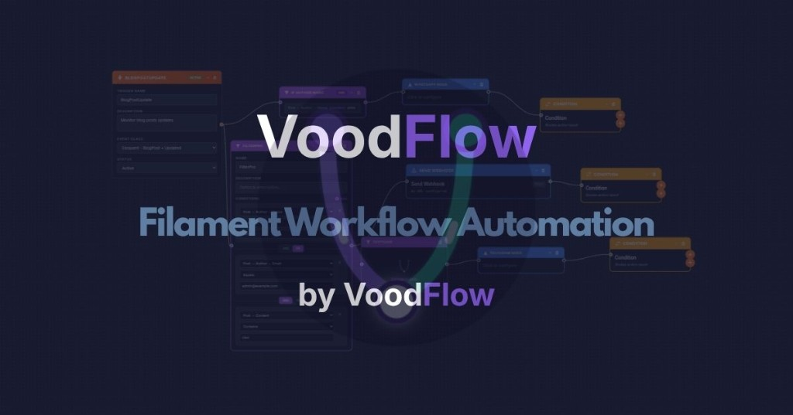

# Voodflow

> Public README mirror for Filament / marketing links. Canonical product docs: [docs.voodflow.com](https://docs.voodflow.com). Package source remains private/licensed.



**Visual workflow automation for [Filament](https://filamentphp.com/) (Laravel)**

Voodflow is a powerful automation plugin for Filament 4 or 5: visual workflows triggered by Laravel events, a drag-and-drop flow editor, human-in-the-loop approvals, webhooks, model integration, execution logs, and an extensible node system.

**Requirements:** PHP 8.2+, Laravel 11+, Filament `^4.0` or `^5.0`.

## Documentation

**Full documentation:** [docs.voodflow.com](https://docs.voodflow.com)

This README summarizes installation (including Anystack), usage patterns, and contributor setup. Details live in the docs.

## Features

- **Visual flow editor** — React Flow–based workflow builder
- **Event-driven** — Trigger flows from Laravel events
- **Human-in-the-loop** — `Request Approval` pauses the run until Approve/Reject (email and/or Filament Approvals inbox); optional notes and recipient match
- **Waits & signals** — `Wait for Signal` / `Date Reached`; resume with `Voodflow::signal()` or `voodflow:process-waits`
- **Secrets** — encrypted values as `{{secrets.key}}` in tags (alongside Credentials for SMTP/OAuth/API)
- **Modular nodes** — Extend with custom nodes and packages (AI / Weaver / OEM via optional add-ons)
- **Execution tracking** — Audit trail for workflow runs
- **Model integration** — Discover and use Eloquent models in payloads
- **Payload configuration** — Control which fields and relations are exposed
- **Licensing** — CORE nodes plus optional paid nodes via Anystack / portal

## Installation

Install the package, then run the interactive installer (publishes config and assets, handles Spatie Laravel Settings migrations when needed, and runs `migrate`):

```bash
composer require voodflow/voodflow
php artisan voodflow:install
```

Register the plugin and policies in your Filament panel as described in the docs.

### Anystack (private Composer repository)

Add the repository to your `composer.json` (see [Anystack: private PHP packages](https://anystack.sh/docs/guides/private-php-packages)):

```json
{
    "repositories": [
        {
            "type": "composer",
            "url": "https://voodflow.composer.sh"
        }
    ]
}
```

Then require the package (Composer will prompt for HTTP Basic auth):

```bash
composer require voodflow/voodflow
```

Example prompt:

```text
Loading composer repositories with package information
Authentication required (voodflow.composer.sh):
Username: [licensee-email]
Password: [license-key]
```

**Credentials**

- **Username:** the email address on your Anystack license, or `unlock` if the license is not assigned to a specific licensee.
- **Password:** your license key from Anystack.

If your license policy requires a **fingerprint**, append it to the license key with a colon:

```text
Password: 8c21df8f-6273-4932-b4ba-8bcc723ef500:your-fingerprint.example
```

If no fingerprint is required, use only the license key (no colon).

You can store the same credentials in `auth.json` or the `COMPOSER_AUTH` environment variable so `composer update` does not prompt every time.

After a successful `composer require`, run:

```bash
php artisan voodflow:install
```

### Portal / dashboard (optional)

The Filament **version** and **license** widgets call **`https://api.voodflow.com`**. The app resolves the license key from Composer auth where possible and uses your application URL as the activation fingerprint. Optional overrides (e.g. local development) are documented in **`config/voodflow.php`** after publishing (`portal` section).

## Usage

### Creating a workflow

1. Open **Workflows** in your Filament panel
2. Click **New workflow**
3. In the visual editor: add a **trigger**, branch with **If / Switch**, add **actions** (webhook, mail, **Request Approval**, etc.)
4. Connect handles between nodes
5. Configure each node in the sidebar (use `{{tags}}` / `{{secrets.key}}` where supported)
6. Save and activate

For approvals: keep a queue worker running (`php artisan voodflow:work` or `queue:work` + `voodflow:process-waits`) so waits resume after human decisions.

### Registering custom events

Plugins can register events for the trigger picker:

```php
use Voodflow\Voodflow\Voodflow;

public function boot(): void
{
    Voodflow::registerEvent(
        eventClass: \App\Events\OrderCreated::class,
        name: 'Order Created',
        description: 'Triggered when a new order is created',
        group: 'E-commerce'
    );
}
```

## Building custom nodes

```bash
php artisan voodflow:make-node MyCustomNode
```

Implement `execute()` in `MyCustomNode.php`, build the React UI in `components/MyCustomNode.jsx`, then:

```bash
php artisan voodflow:build-node MyCustomNode
php artisan voodflow:package-node MyCustomNode   # optional distributable ZIP
```

## Architecture

1. Laravel fires an event → Voodflow matches triggers → nodes run in order via `ExecutionContext`.
2. **Licensing:** CORE nodes are always available; paid nodes are validated through the portal (`LicenseService`) using Composer / Anystack credentials.

## Development (package contributors)

```bash
composer install
npm ci
npm run build   # regenerates resources/dist/*
composer test
```

## Links

- **Docs:** [docs.voodflow.com](https://docs.voodflow.com)
- **Issues:** [github.com/voodflow/voodflow/issues](https://github.com/voodflow/voodflow/issues)
- **License:** [Voodflow Source-Available](LICENSE.md)

## Credits

- Voodflow
