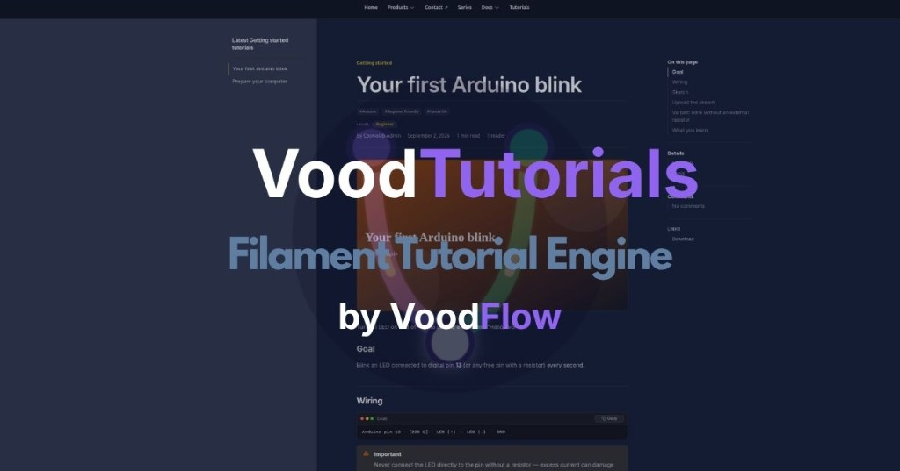

# VoodTutorials (`voodflow/vtuts`)

> Public README mirror for Filament / marketing links. Canonical product docs: [docs.voodflow.com](https://docs.voodflow.com). Package source remains private/licensed.



**Version 0.0.20** · **Paid plugin — source-available (not Open Source)**

Commercial Filament 5 package for technical tutorials: markdown, table of contents, materials, tools, resources, SEO, translations, comments, learning paths (series), Integration typography with Voodbuilder, and optional public routes.

Production use requires a **paid Voodflow license** via [Anystack](https://anystack.sh). Source is available for audit and local development under the [Voodflow Source-Available License](https://docs.voodflow.com) — this is **not** MIT/Apache Open Source. See [docs.voodflow.com](https://docs.voodflow.com).

Requires a **Filament 5** admin panel in your Laravel 12+ / 13+ app. Pair with [voodflow/voodbuilder](https://github.com/voodflow/voodbuilder) (Community free) for the public site shell, or keep the bundled **standalone** theme when you are not using Voodbuilder.

## Requirements

- PHP 8.4+
- Laravel 12 or 13
- Filament 5
- [voodflow/vmedia](https://github.com/voodflow/vmedia) — Media Vault (featured images, galleries, markdown uploads)
- [ralphjsmit/laravel-seo](https://github.com/ralphjsmit/laravel-seo)
- [ralphjsmit/laravel-filament-seo](https://github.com/ralphjsmit/laravel-filament-seo)
- [spatie/laravel-markdown](https://github.com/spatie/laravel-markdown)
- [relaticle/comments](https://github.com/relaticle/comments)
- [spatie/laravel-medialibrary](https://github.com/spatie/laravel-medialibrary)

## Optional dependencies

| Package | Purpose |
|---------|---------|
| [voodflow/voodbuilder](https://github.com/voodflow/voodbuilder) | Site shell (nav, footer, theme) + Integration typography — **recommended** for production sites |
| [bezhansalleh/filament-shield](https://github.com/bezhansalleh/filament-shield) | Role-based admin permissions + Users resource in the panel |
| [spatie/laravel-permission](https://github.com/spatie/laravel-permission) | Required by Filament Shield |
| [laravel/mcp](https://github.com/laravel/mcp) | MCP tools for AI-assisted authoring |
| [spatie/laravel-sitemap](https://github.com/spatie/laravel-sitemap) | XML sitemap integration |

## Installation

### Anystack (private Composer repository)

Licensed customers install from the Anystack private registry (see [Anystack: private PHP packages](https://anystack.sh/docs/guides/private-php-packages)). Add the repository to your Laravel app `composer.json`:

```json
{
    "repositories": [
        {
            "type": "composer",
            "url": "https://vtuts.composer.sh"
        }
    ]
}
```

Then require the package:

```bash
composer require voodflow/vtuts
php artisan vtuts:install
```

Composer will prompt for HTTP Basic auth against `vtuts.composer.sh`:

```text
Loading composer repositories with package information
Authentication required (vtuts.composer.sh):
Username: [licensee-email]
Password: [license-key]
```

**Credentials**

- **Username:** the email address on your Anystack license, or `unlock` if the license is not assigned to a specific licensee.
- **Password:** your license key from Anystack.

If your license policy requires a **fingerprint**, append it to the license key with a colon:

```text
Password: 8c21df8f-6273-4932-b4ba-8bcc723ef500:your-fingerprint.example
```

If no fingerprint is required, use only the license key (no colon).

You can store the same credentials in `auth.json` or the `COMPOSER_AUTH` environment variable so `composer update` does not prompt every time.

### From GitHub (Composer)

```json
{
    "repositories": [
        {
            "type": "vcs",
            "url": "https://github.com/voodflow/vtuts.git"
        }
    ],
    "require": {
        "voodflow/vtuts": "^0.0.19"
    }
}
```

Then run:

```bash
composer update voodflow/vtuts
php artisan vtuts:install
```

### Local path (development)

```json
{
    "repositories": [
        { "type": "path", "url": "packages/voodflow/vtuts" }
    ],
    "require": {
        "voodflow/vtuts": "*"
    },
    "autoload": {
        "psr-4": {
            "Voodflow\\Vtuts\\": "packages/voodflow/vtuts/src/"
        }
    }
}
```

When using a path repository inside Docker, add the explicit PSR-4 autoload entry above and run `composer dump-autoload -o` so classes resolve from `packages/` instead of a broken `vendor/` symlink.

### `vtuts:install`

The install command publishes configs and migrations for tutorials and its dependencies, patches known `relaticle/comments` migration issues for MySQL, publishes Filament Shield assets when installed, seeds the default **Style guide** markdown template, then runs `migrate`.

```bash
php artisan vtuts:install
```

Options:

| Option | Description |
|--------|-------------|
| `--force` | Overwrite already published files |
| `--skip-migrate` | Publish only, without running migrations |

When Filament Shield is installed, `vtuts:install` publishes Shield/permission assets, runs migrations, then offers to create the tutorials role matrix.

You can also run the role setup manually:

```bash
php artisan vtuts:shield-roles --generate --super-admin=1
```

Add `HasRoles` to your `User` model when using Shield:

```php
use Spatie\Permission\Traits\HasRoles;

class User extends Authenticatable
{
    use HasFactory, HasRoles, Notifiable;
}
```

### Sample content

Seed demo tutorials, categories, tags, and three learning **series** (with ordered lessons):

```bash
php artisan vtuts:seed-samples
php artisan vtuts:seed-samples --fresh   # wipe previous sample slugs first
```

The seeder also creates **Tutorial sample covers** / **Tutorial sample series** galleries under the Tutorials vault root ([voodflow/vmedia](https://github.com/voodflow/vmedia)) and attaches SVG featured images.

## Admin authorization (with / without Shield)

Tutorial Filament resources (Tutorials, Series, Categories, Tags, Templates) use Laravel policies. **Settings** has no model policy, so it stays visible even when other items are denied.

### Without Filament Shield (stock Filament)

You do **not** need Shield to use vtuts. When the Shield package is **not** installed, the default authorization driver (`auto`) allows any user who can access the Filament panel to manage all tutorial resources.

| Driver (`vtuts.authorization.driver` / `VTUTS_AUTHORIZATION`) | Behaviour |
|---------------------------------------------------------------|-----------|
| `auto` (default) | Shield present → named abilities (`ViewAny:Vtut`, …). Shield **absent** → any Filament panel user |
| `permissions` | Always require Shield-style abilities (custom Gate / Shield) |
| `panel` | Always allow Filament panel users (ignore named abilities) |

If Shield is installed as a Composer dependency but you are not using it for vtuts:

```env
VTUTS_AUTHORIZATION=panel
```

Or disable Shield wiring on the plugin / config:

```php
VtutsPlugin::make()->shield(false);
```

```php
// config/vtuts.php
'shield' => [
    'enabled' => env('VTUTS_SHIELD_ENABLED', true),
],
```

### With Filament Shield

When `bezhansalleh/filament-shield` is installed and `shield.enabled` is `true`:

1. Run `php artisan vtuts:shield-roles --generate --super-admin=1` (or accept the prompt during `vtuts:install`).
2. Assign `super_admin` / `editor` (and public roles as needed) to users.
3. Without those permissions, the Tutorials nav shows **only Settings** — that is expected, not a broken install.

`VtutsPlugin` then also registers `FilamentShieldPlugin` and the package `UserResource`.

## Core concepts

Vtuts separates **what you teach** (content) from **how it is organised** (taxonomy and paths).

| Concept | Purpose | Example |
|---------|---------|---------|
| **Tutorial** | A single article with markdown body, intro, excerpt, SEO, materials/tools/resources | “CosmoBlink — your first C++ example” |
| **Category** | Broad topic for filtering and sidebar grouping | `C++`, `Getting started` |
| **Series** | Ordered learning path (lessons in sequence) | `C++ Basics` → lesson 1, lesson 2, … |
| **Template** | Reusable markdown skeleton for new tutorials | `style-guide` (seeded on install) |
| **Tag** | Optional cross-cutting labels (feature flag) | `embedded`, `audio` |

A tutorial can belong to **one category**, appear in **one or more series**, and link to **next steps** (other tutorial IDs shown at the end of the article).

**Category vs series**

- **Category** = “what kind of tutorial is this?” (used on the listing page and category archives).
- **Series** = “what order should I read these in?” (course bar, prev/next, progress tracking).

Example: category `C++`, series `C++ Basics` containing lessons mapped to `examples/cpp/01_basics/*` in your project docs.

## Markdown authoring

Tutorial bodies are written in **GitHub Flavored Markdown**. The renderer (`VtutMarkdown`) adds VitePress-style callouts and enhanced code blocks.

### Document structure

| Field | Role |
|-------|------|
| **Introduction** | Short summary above the article (also rendered as markdown) |
| **Content** | Main body — use `##` / `###` headings for the table of contents |
| **Excerpt** | ~160 characters for listing cards |

Use `##` for main sections (they appear in the right-hand **On this page** outline). Use `###` for subsections.

### Headings and table of contents

```markdown
## Overview

## What you need

## Build and flash

### Compile

### Upload to the board
```

Headings `##` and `###` receive stable anchor IDs and appear in the doc aside TOC.

### Inline code and code blocks

Wrap commands, filenames, and identifiers in backticks:

```markdown
Install `arm-none-eabi-gcc`, then run `make program-dfu`.
```

Fenced blocks with a **language tag** get syntax highlighting (Shiki), a language label, line numbers, and a copy button (when [voodflow/voodbuilder](https://github.com/voodflow/voodbuilder) is installed):

````markdown
```bash
cd examples/cpp/01_basics/CosmoBlink
make clean && make
```

```cpp
#include "daisy_cosmolab.h"

DaisyCosmolab hw;
```
````

Supported languages follow Spatie Markdown / Shiki (e.g. `bash`, `cpp`, `ini`, `python`, `json`).

### Callouts (alerts)

GitHub-style alerts render as coloured boxes with icons:

```markdown
> [!NOTE]
> Install the toolchain before continuing.

> [!TIP]
> Compare with the next example in the same folder.

> [!IMPORTANT]
> Run `install.bat` on Windows instead of `install.sh`.
```

Also supported: `> [!WARNING]`.

Legacy blockquote syntax still works:

```markdown
> **Important note:** Your safety message here.
```

### Tables, lists, and GFM extras

- **Tables** — standard pipe tables
- **Task lists** — `- [x] Done` / `- [ ] Todo`
- **Strikethrough** — `~~removed~~`
- **Links and images** — standard markdown

### Introduction deduplication

If the introduction paragraph is repeated at the start of the content body, it is automatically removed from the displayed body so it does not appear twice on the public page.

### Default template

`vtuts:install` seeds a **Style guide** template (`slug: style-guide`) with all common patterns. In Filament, pick **From template** when creating a tutorial, or fetch it via MCP (`get_vtut_template`).

## Tutorial series (learning paths)

Series group tutorials into ordered lessons — like a course or a chapter sequence.

### Admin workflow

1. Create tutorials (draft or published).
2. **Tutorials → Series** — create a series (title, slug, description, locale).
3. Attach lessons and drag to reorder (or use MCP `sync_vtut_series_lessons`).

### Public URLs

When `features.series` is `true` (default):

| URL | Route name | Purpose |
|-----|------------|---------|
| `/tutorials/series` | `vtuts.series.index` | All published series |
| `/tutorials/series/{slug}` | `vtuts.series.show` | Series landing page + lesson list |
| `/tutorials/series/{series}/{lesson}` | `vtuts.series.lesson` | Lesson inside series context |

Series lesson pages show a **course bar**: progress, previous/next lesson, and the full lesson list. Authenticated users can persist progress (`POST …/progress`).

Visibility gates (registered / subscriber) apply to series lesson routes the same way as standalone tutorials.

### MCP: `sync_vtut_series_lessons`

Replaces the **entire** ordered lesson list for a series (not incremental append):

```json
{
  "series_slug": "cpp-basics",
  "locale": "en",
  "lesson_slugs": ["cosmoblink", "cosmo-display"]
}
```

Lesson 1 → `cosmoblink`, lesson 2 → `cosmo-display`. Call again with the full ordered list when you add or reorder lessons.

## Filament admin

Register the plugin in your panel provider:

```php
use Voodflow\Vtuts\VtutsPlugin;

$panel->plugins([
    VtutsPlugin::make(),
]);
```

See [Admin authorization (with / without Shield)](#admin-authorization-with--without-shield) for how resources appear in the panel.

Admin resources: **Tutorials**, **Templates**, **Categories**, **Series**, **Tags**, **Settings**, and optionally **Users** + Shield Roles.

**Settings** includes listing page copy, pagination, sidebar, read tracking, access-gate URLs, and **MCP** defaults (author email, draft vs publish, optional server code roots).

### Shield roles and tutorial visibility

| Role | Filament panel | Public tutorials |
|------|----------------|------------------|
| `super_admin` | Full access (Shield) | All visibility levels |
| `editor` | Create, edit, publish tutorials, categories, tags, templates, series | Same as any logged-in user |
| `registered` | No admin permissions | Can read **Registered** tutorials (must be logged in) |
| `subscriber` | No admin permissions | Can read **Subscriber** tutorials (`access subscriber content` permission) |

Tutorial **visibility** (per article):

| Visibility | Who can read |
|------------|--------------|
| Public | Everyone |
| Registered users | Any authenticated user |
| Subscribers | Users with the `access subscriber content` permission |

Typical assignments:

- Staff who write tutorials → `editor`
- Users who sign up on the site → `registered`
- Paying members → `subscriber`
- Project owner → `super_admin`

Customize role names and permission subjects in `config/vtuts.php` under `shield.roles`.

### SubKit + Stripe (optional paid access)

When [SubKit](https://filamentphp.com/plugins/ihor-k-subscription-kitsubkit) and Laravel Cashier are installed:

| What you get | Details |
|--------------|---------|
| Pricing page | `/vtuts.pricing` with `<x-subkit::pricing-table>` |
| Account page | `/vtuts.subscription` with `<x-subkit::manage-subscriptions>` |
| Gate CTA | Subscriber-only tutorials link to pricing automatically |
| Admin | SubKit Filament plugin registered by `VtutsPlugin` |
| Access sync | Stripe webhooks + login keep the `subscriber` Shield role in sync |

```bash
composer require karpovigorok/subkit laravel/cashier
php artisan vtuts:install
```

Disable SubKit integration:

```php
VtutsPlugin::make()->subkit(false);
```

## Configuration

Publish and edit `config/vtuts.php`:

| Key | Purpose |
|-----|---------|
| `prefix` | URL prefix (default: `tutorials`) |
| `force_standalone` | Keep native vtuts layouts even when Voodbuilder is installed (see below) |
| `layout` / `doc_layout` | Blade layouts (auto-switched when integrated with Voodbuilder) |
| `authorization.driver` | `auto` / `permissions` / `panel` (see Admin authorization) |
| `author_model` | Author Eloquent model |
| `locales` / `default_locale` | Content languages |
| `features.*` | Routes, feed, sitemap, tags, comments, localization, **series** |
| `visibility.*` | Content visibility gate |
| `shield.enabled` | Filament Shield + Users resource |
| `subkit.*` | Optional SubKit + Cashier |
| `mcp.*` | MCP defaults (overridable in Admin → Settings → MCP) |

### Public frontend layouts (standalone vs Voodbuilder)

Vtuts ships its **own** Blade layouts (`vtuts::layouts.*`). When [voodflow/voodbuilder](https://github.com/voodflow/voodbuilder) is installed, the package **integrates into Voodbuilder chrome by default** (nav, footer, Theme Map, Integration typography preview).

| Mode | Config | Result |
|------|--------|--------|
| **Integrated** (recommended with Voodbuilder) | `force_standalone` = `false` (default) | Uses `vtuts::layouts.voodbuilder` / `vtuts::layouts.voodbuilder-page` inside Voodbuilder chrome; reserves the tutorials URL prefix |
| **Standalone** | `force_standalone` = `true` or `VTUTS_FORCE_STANDALONE=true` | Keeps original `vtuts::layouts.*` shell (does **not** pick up Voodbuilder theme/nav) |

```env
# Keep package-native layouts (no Voodbuilder shell)
VTUTS_FORCE_STANDALONE=true

# Use Voodbuilder layouts when the package is present (default)
VTUTS_FORCE_STANDALONE=false
```

```php
// config/vtuts.php
'force_standalone' => env('VTUTS_FORCE_STANDALONE', false),
```

After changing this, run `php artisan config:clear`.

Optional: `php artisan voodbuilder:install` can also patch a published `config/vtuts.php` and wire the language switcher. With integration you get shared nav/footer, `theme.css` via Vite, and enhanced code blocks (`vp-code-block` with copy button).

#### Standalone layout views

| Layout | Purpose |
|--------|---------|
| `vtuts::layouts.page` | Index, category, tag, series listings |
| `vtuts::layouts.doc` | Single tutorial (sidebar, TOC, materials, comments) |
| `vtuts::layouts.app` | Base shell (nav, footer, theme toggle) |

```bash
php artisan vendor:publish --tag=vtuts-assets
```

**Public comments** use Relaticle. Add the commenter trait to your user model:

```php
use Voodflow\Vtuts\Concerns\CanComment;

class User extends Authenticatable
{
    use CanComment, HasFactory, Notifiable;
}
```

## Public routes

Registered when `features.public_routes` is `true`:

| URL | Route name |
|-----|------------|
| `/tutorials` | `vtuts.index` |
| `/tutorials/{slug}` | `vtuts.show` |
| `/tutorials/series` | `vtuts.series.index` |
| `/tutorials/series/{slug}` | `vtuts.series.show` |
| `/tutorials/series/{series}/{lesson}` | `vtuts.series.lesson` |
| `/{locale}/tutorials/...` | `vtuts.localized.*` |
| `/tutorials/category/{slug}` | `vtuts.category` |
| `/tutorials/tag/{slug}` | `vtuts.tag` |
| `/tutorials/preview/{vtut}` | signed preview |
| `/tutorials/feed` | RSS feed |

Set `prefix` in `config/vtuts.php` (or `VTUTS_PREFIX` in `.env`). Route names stay `vtuts.*`.

Middleware:

- `vtuts.locale` — sets `app()->getLocale()` from the URL
- `vtuts.visible` — visibility gate for registered/subscriber content

## Tutorial page layout

Doc-style pages include:

- **Left sidebar** — latest tutorials from the same category, or series lesson list on series URLs
- **Main column** — title, meta, video, markdown, materials/tools/resources, comments
- **Right aside** — table of contents, section anchors, comments link, deduplicated external links from materials/tools/resources

## Multilingual content

1. Configure `locales` and `default_locale`
2. Enable `features.localization`
3. Create translations in Filament (Translate action)
4. Default locale: `/tutorials/...`; others: `/{locale}/tutorials/...`
5. SEO `hreflang` alternates per tutorial

Admin UI strings: `resources/lang/{locale}/admin.php` (English and Italian included).

## Sitemap

```php
use Spatie\Sitemap\Sitemap;
use Voodflow\Vtuts\Support\VtutSitemapGenerator;

Sitemap::create()
    ->pipe(fn ($sitemap) => VtutSitemapGenerator::addToSitemap($sitemap))
    ->writeToFile(public_path('sitemap.xml'));
```

## MCP server (AI authoring)

Install the optional dependency:

```bash
composer require laravel/mcp
```

Vtuts registers `VtutsServer` automatically:

- **HTTP** — `{APP_URL}/mcp/vtuts` (default route)
- **Stdio** — `php artisan mcp:start vtuts` (local process transport)

### How it works

MCP is the **publish button** for your AI agent — not a code editor.

1. You work on source material in your AI tool (open files, pasted code, conversation).
2. The agent composes tutorial markdown (headings, code blocks, callouts).
3. MCP tools save the result to **this site's database** (`create_vtut`, series tools, etc.).

The AI agent already sees your workspace. You do **not** need to mount external repositories or configure code roots for the typical workflow.

### Setup (out of the box)

1. **Admin → Tutorials → Settings → MCP**
   - Default author email (staff user that owns AI-created tutorials)
   - Publish immediately vs save as **draft** (draft recommended)
   - Optional: enable server-side code roots (off by default)
2. Run `php artisan vtuts:mcp-info` and copy the configuration snippet into your MCP client.
3. Reconnect the MCP client in your AI tool.

```json
{
  "mcpServers": {
    "vtuts": {
      "url": "https://your-site.test/mcp/vtuts"
    }
  }
}
```

For local development, use your local `APP_URL` (e.g. `http://localhost:8002/mcp/vtuts`). The site must be running and reachable.

### MCP tools

| Tool | Purpose |
|------|---------|
| `list_vtut_templates` | List markdown templates |
| `get_vtut_template` | Fetch template body (e.g. `style-guide`) |
| `list_vtuts` | List existing tutorials (avoid duplicates) |
| `create_vtut` | Create or update a tutorial (`slug` + `locale` upsert) |
| `list_vtut_series` | List learning paths |
| `create_vtut_series` | Create or update a series |
| `sync_vtut_series_lessons` | Set ordered lesson list for a series |
| `search_project_code` | **Optional** — search files on the server |
| `read_project_file` | **Optional** — read a file from server code roots |

`create_vtut` saves **drafts** by default unless `publish: true` or **Settings → MCP → Publish tutorials immediately** is enabled.

### Optional server code roots

Enable only when the AI agent runs **without** workspace context and must read files **on the server** (e.g. a cloned repo at `/var/www/myproject`).

- **Admin → Settings → MCP → Enable server-side code roots**
- One absolute path per line
- Activates `search_project_code` and `read_project_file`

Leave disabled for normal use: the agent reads from the conversation instead.

### Environment variables

| Variable | Default | Purpose |
|----------|---------|---------|
| `VTUTS_FORCE_STANDALONE` | `false` | Keep native vtuts layouts instead of Voodbuilder |
| `VTUTS_AUTHORIZATION` | `auto` | Admin policy driver (`auto` / `permissions` / `panel`) |
| `VTUTS_MCP_ENABLED` | `true` | Master switch |
| `VTUTS_MCP_HTTP_ROUTE` | `mcp/vtuts` | HTTP endpoint path |
| `VTUTS_MCP_DEFAULT_AUTHOR_EMAIL` | — | Fallback author (Settings overrides) |
| `VTUTS_MCP_DEFAULT_PUBLISH` | `false` | Fallback publish flag |
| `VTUTS_MCP_ENABLE_PROJECT_ROOTS` | `false` | Env fallback for code roots toggle |
| `VTUTS_MCP_PROJECT_ROOTS` | — | Comma-separated server paths |

## Testing

```bash
composer install
./vendor/bin/phpunit
```

## Features

- Filament CRUD with drafts, scheduling, bulk publish/unpublish
- Translation groups with per-locale slugs
- Markdown TOC, GitHub alerts, GFM tables, Shiki code blocks
- Materials, tools, resources sidebars with deduplicated aside links
- Tutorial **series** with ordered lessons and progress tracking
- SEO (Filament + schema.org TechArticle)
- Public comments via Relaticle
- Optional Filament Shield + Users resource
- Standalone dark/light theme with bundled CSS
- MCP tools for AI-assisted authoring
- voodbuilder dynamic block: Latest tutorials

## License

**Voodflow Source-Available License** — the source is visible for audit and local development, but this is **not Open Source**. Production use requires a **paid license** from Voodflow. See [LICENSE](https://docs.voodflow.com) and [docs.voodflow.com](https://docs.voodflow.com).

The site shell [voodflow/voodbuilder](https://github.com/voodflow/voodbuilder) is **Community free** (source-available; not OSI Open Source).
